# Editor UI & Shortcuts

Guide to using the Tanim timeline editor interface, keyboard shortcuts, and mouse interactions.

## Overview

The Tanim editor provides a timeline-based interface for creating and editing animations.

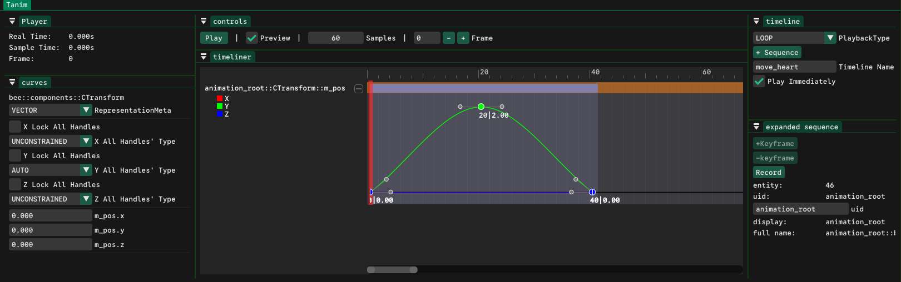

## Editor Layout

The Tanim editor window consists of several main sections:

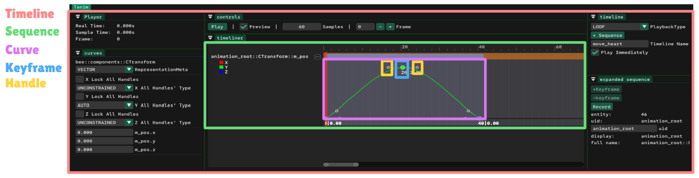

**Tanim:** Parent window of the tool.

**Controls:** Contains controls that affect the playhead's position, and playing state of the tool.

**Player:** Shows more detailed information about the playhead's position.

**Timeline:** Shows information and controls related to the entire timeline.

**Expanded Sequence:** When you expand a sequence, information and controls related to that sequence shows in this area.

**Curves:** Shows information and controls related to all the curves in the expanded sequence.

**Timeliner:** Shows sequences one after another. When you expand a sequence, it shows its curves, keyframes on each curve, and handles of each keyframe.

## Common workflow

1. Open a timeline for editing by calling [tanim::OpenForEditing](integration-reference.md#tanim%20OpenForEditing).

   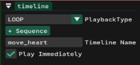

2. Click the "+Sequence" button in the Timeline window. Every field in every component that you have registered to Tanim before and is attached to the entities in the list of `EntityData` that you had sent in OpenForEditing will show up. Choose the parameter you want to animate.

   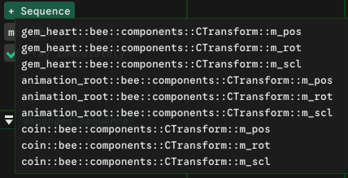

3. A new sequence will be added in the Timeliner window. You can expand it by double-clicking it.

   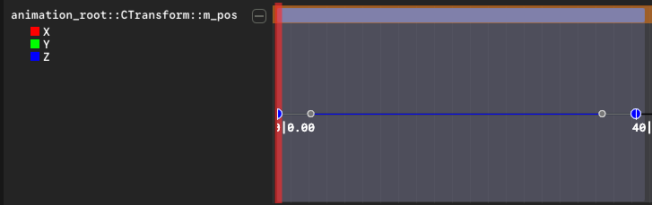

4. Based on the type of the field you are animating, a number of curves will be shown. Each curve has a distinct color, and the name of the parameter beside it.

   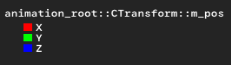

5. By clicking on the name of the curve, you can toggle its visibility. This helps when curves are stacked on top of each other and have a lot of overlaps. Or when you want to focus on animating only a single curve. It has no other effect other than visuals.

   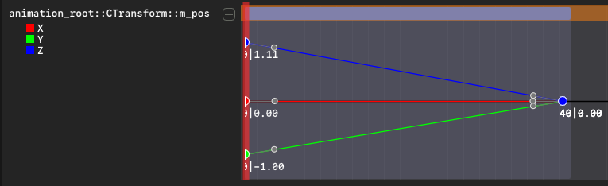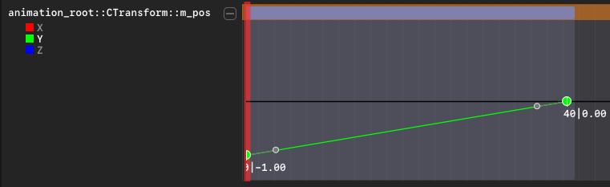

   The first value under the keyframe is the frame number (X axis), and the second number is its value (Y axis).

   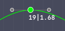

6. Now you have various options to modify the keyframes and the curve. See the following sections.

## Adding keyframes

- Double-Click anywhere on a curve that doesn't have a keyframe in that position.
- Move the playhead to a frame that doesn't have a keyframe in all the curves. The "+Keyframe" button in the expanded sequence will be enabled. Click on it, and a keyframe will be created on all the curves that don't already have it in that frame.
  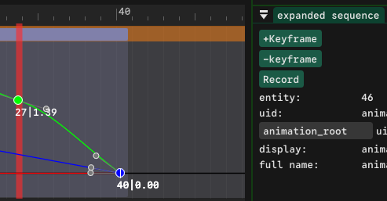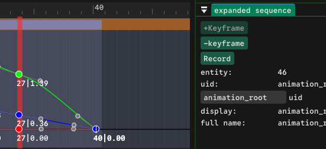

## Selecting keyframes

Selected keyframes get a white diamond border to make them distinct.

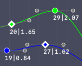

- Left-click on a single keyframe to make it selected.
- On an area where there is no keyframe under the cursor, press left-click and drag to make a selection.

  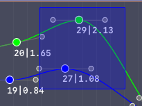 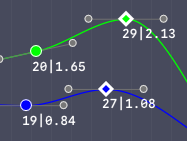

- Click-Drag to make a selection of keyframes, then drag one of the selected ones to drag all the selected ones.
- You can add to the selection by holding the keyboard "SHIFT" key and clicking on a keyframe that is not already selected. Any keyframe on the curve between the previously selected ones and the new one will also be added to the selection.

  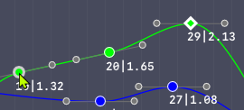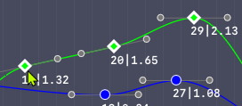

- You can add to the selection by holding the keyboard "SHIFT" key and click-dragging to make a new selection. Any keyframe that was not in the selection, will be added to the selction.
- You can hover over a curve. It turns white. Now if you shift-click somewhere that there is no keyframe under the cursor, all the keyframes on that curve will be added to the selection.
- Holding the keyboard CTRL key and clicking on any keyframe at any state, will toggle its selection.

## Deleting keyframes

- Right-click on a single or a selection of keyframes and select "Delete Keyframe" from the context menu.
- When there is a single or a selection of keyframes, press they keyboard "DEL" key.
- Move the playhead to a frame where there are keyframes on some or all curves. The "-Keyframe" button in the expanded sequence will be enabled. Clicking on it will delete any keyframe that was on any curve at the frame of the playhead.

  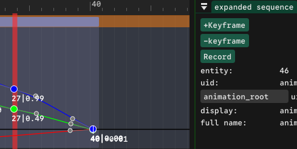 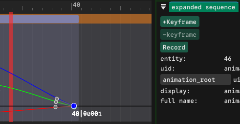

**Note** that the context menu disables the "Delete Keyframe" button if any of the keyframes deletion is restricted by Tanim; i.e. when they are first/last frame on a curve, or they are in a quaternion sequence. In a quaternion sequence the only way to delete keyframes is using the "-Keyframe" button.

## Modifying keyframes

- Drag selected keyframes around.
- Right-click on a keyframe. Select "Edit keyframe" in the context menu. The playhead will move to the keyframe's frame. Then the parameter for any curve that had a keyframe there, will be enabled for editing in the Curves window. Changing the value there, will change the keyframe's value (Y axis).

  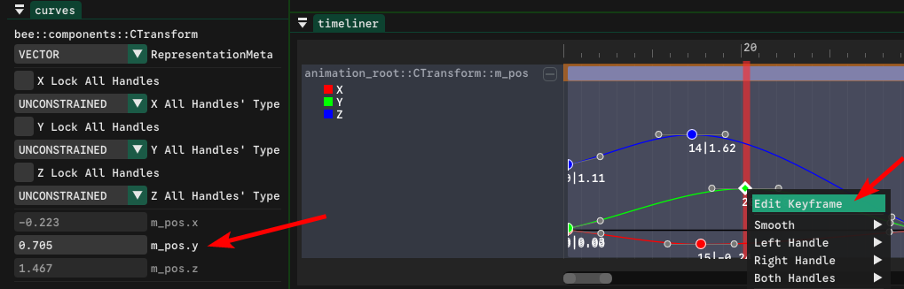

- Another way to modify the keyframes is by recording. See [Preview & Record](#Preview%20&%20Record) for more details.

## Notes

- First keyframe on a curve always sticks to the beginning of the sequence.
- Last keyframe on a curve always stick to the ending of the sequence.
- Deleting the first keyframe on a curve and the last keyframe on a curve is restricted by Tanim.
- If multiple keyframes are overlapping and you drag them, only the top one will be moved. If you want to move all of them manually, you can make a selection by click-dragging in that area, then moving 1, will move all of them.
- Manually moving keyframes on a quaternion sequence is restricted by Tanim. For more info on why & how to modify them, see [glm::quat](supported-types.md#glm%20quat).

## Preview & Record

### Preview

**Preview** is a checkbox in the Controls window.

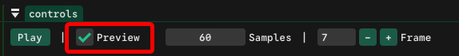

While it is checked, Tanim writes to every field in every sequence based on the sampled value from the curves every frame; So you can see how the curves affect the entity, and how the animation looks, without having to enter your engine's play mode.

During this time, any changes you make to your entities animated parameters using any means that are in your engine, and not provided by Tanim, will be overwritten by Tanim. E.g. if you are animating an entity's position, and the Preview is checked, then if you move that entity using ImGuizmo, or by changing the position X,Y,Z values through your engine's inspector, the changes are immediately overwritten by Tanim based on the curves.

If you uncheck Preview, move the entity through your engine, then check preview back on again, again, any changes you had made to the animated fields in the timeline on the entity will be overwritten by Tanim.

These overwrites happen because preview shows exactly what will happen if you play the animation during your engine's "play" or "run" mode.

If you want to manipulate the animation through your engine's tools, like ImGuizmo or your inspector, so that your engine overwrites Tanim's curves, Tanim provides the "Record" feature.

### Record

**Record** is a button in the Expanded Sequence window.

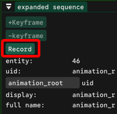

As seen in the previous section, Preview, Tanim always overwrites your engine's changes to the animated parameters. If you want the reverse, to be able to change the animations keyframes through your engine, you should use the Record button.

This is the workflow:

1. Expand the sequence you want to modify.
2. Move the playhead to the frame that you want to record.
3. Click on the Record button. It will create keyframes on any curve that didn't have a keyframe at the playhead's frame. And it will change the Record button to "Stop Recording" button.
4. Now as while as the button says "Stop Recording" any changes you make to the values affected by that sequence through your engine, will be written to that keyframe in Tanim as well. So for example if you are animating an entity's position, you can move it using ImGuizmo, your own Inspector, some script, or any other way, and it will change the keyframe's value in Tanim, and you can see it happening live.
5. At any moment during recording, if you move the playhead, or click on "Stop Recording", the recording will stop. (This is planned to change in future releases, to make it behave more like unity, where moving the playhead & making a new change, will make new keyframes automatically.)

The video below shows an example of this process:

  <video src="https://github.com/user-attachments/assets/aa80a157-a92d-4a0c-b2ad-8716d5677bd4" width="700" height="400" controls></video>
   
  <em>Note that the top-left window titled "Gizmo Controls" is from my custom engine and is not included in Tanim.</em>

## Modifying keyframe handl

es

Tanim uses a Piece-Wise Cubic Bezier Curve. Each keyframe has 2 handles, In & Out. Changing the position and properties of these handles is needed for fine-tuning the curves to reach the exact results you want from the animations flow.

The right-click context menu of each keyframe allows for adjusting these handles through free positioning, as well as using some presets. The options here are highly inspired by Unity Engine's curve-editing system.

The context menu works for multiple selected keyframes as well. In which it disables an option if it can not be set for any keyframe's handles.

### Smooth Modes

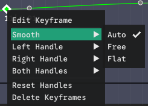

| Smooth Mode | Description                                                                                                                                                                                            |
| ----------- | ------------------------------------------------------------------------------------------------------------------------------------------------------------------------------------------------------ |
| **AUTO**    | Tanim automatically calculates smooth tangents using a monotonic Catmull-Rom algorithm. For the convenience of the user, moving keyframes around, causes the affected AUTO handles to be recalculated. |
| **FREE**    | When you move a handle in Smooth mode, both handles move together symmetrically, ensuring smooth C1 continuity at the keyframe                                                                         |
| **FLAT**    | Horizontal tangents at the keyframe, creating ease-in/ease-out effect                                                                                                                                  |

### Broken Modes

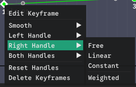

| Broken Mode  | Description                                                                      |
| ------------ | -------------------------------------------------------------------------------- |
| **FREE**     | Handles can be adjusted independently, allowing sharp changes in curve direction |
| **LINEAR**   | Straight line interpolation between keyframes (Hides the handle as well)         |
| **CONSTANT** | No interpolation, immediate value change (Hides the handle as well)              |

### Weighted

Is a toggle. When unchecked, Tanim automatically calculates the length of the handle using the 1/3 rule. When checked, Tanim allows you to change the length yourself. The length affects the influence region; longer handles create gentler curves.

### Restrictions

These are some of the restrictions in the context menu that are applied by Tanim, to ensure curve validity.

- Tanim restricts the handle positions to the neighboring keyframes to ensure monotonicity, or in other words, making sure there is no more than 1 Y value for a single X, and that no loops can be created. Ensuring valid curves at all times.
- Modifying the left handle of the first keyframe of a curve is restricted.
- Modifying the right handle of the last keyframe of a curve is restricted.
- Setting the left handle of a curve to Constant is restricted. Only the right handles can be set to Constant. By doing so, modifying the left handle of the next keyframe on the curve will be restricted, because changing it wouldn't make any difference, or have any meaningful effect.
